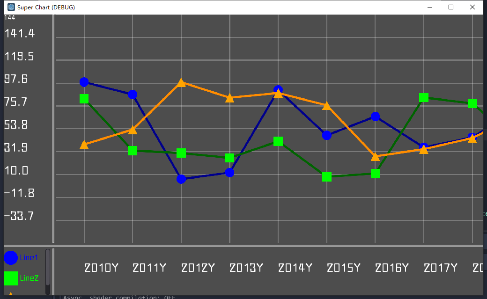

# Godot-2D-Super-Chart
可拖拽和缩放的折线图插件

## 安装和使用
1. 只需要把addons文件夹里的内容拷贝到你的项目
2. 实例化SuperChart文件夹下的SuperChart.tscn场景
3. 调整场景实例的参数（当然你也可以不调整）
4. 在代码里调用场景实例的read_data或read_file方法来读取原始数据
5. 在代码里调用场景实例的init_all方法来初始化图表

## 说明
- 这是专供大数据量、无法在一个屏幕内显示完全的 **折线图** 的，至于饼图、散点图，请找其他插件
- 仓库项目还有个Demo文件夹，里面有个Demo.tscn场景，以供参考
- 使用read_file读取文件时，请根据你自己的分隔符去修改图表的element_delimiter属性
- 使用read_file读取文件时，每一行的末尾表示这一条线的名称
- 更多内容可以自己试试

